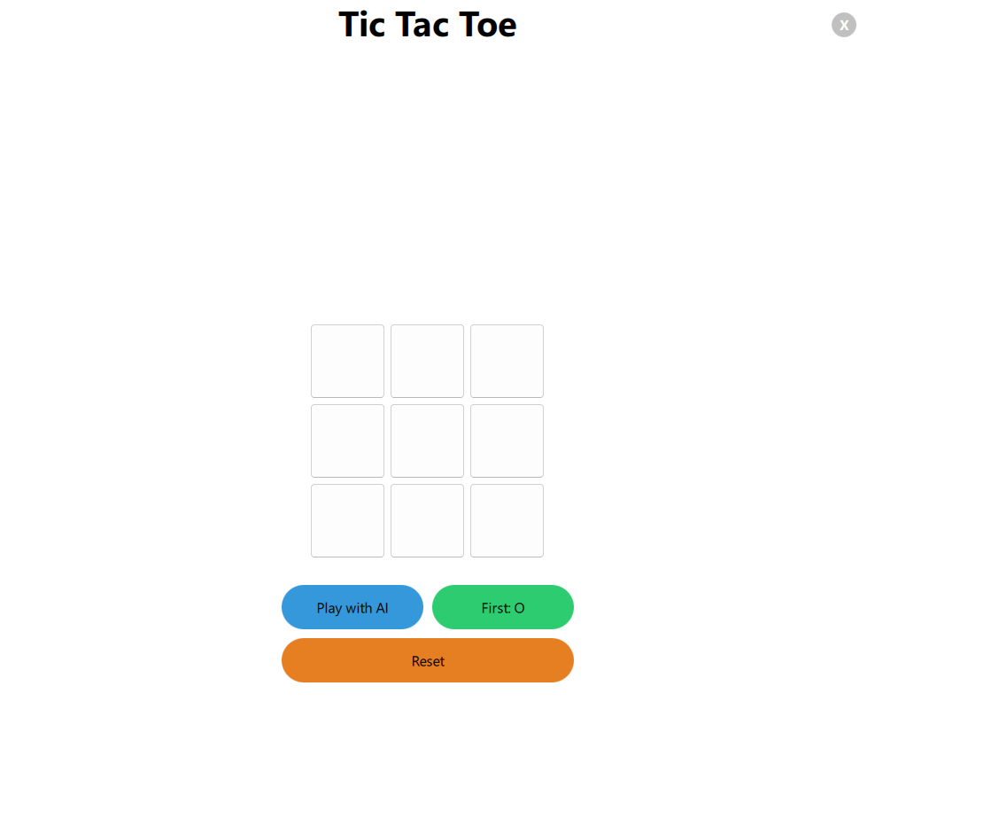

# ❌⭕ Tic-Tac-Toe in Qt (MVC Architecture)

A clean, modern implementation of the classic **Tic-Tac-Toe** game using **C++** and the **Qt framework**, built following the **Model-View-Controller (MVC)** design pattern.

---

## 🖼️ Interface Screenshots

<div align="center">
  
</div>

---

## ✨ Features

- 🔄 **MVC Architecture** – clean separation of logic, presentation, and control.
- 🧠 Smart turn handling with win/draw detection.
- 🎨 Simple and responsive user interface built in Qt.
- ❌⭕ Custom graphics for X and O.
- 🧪 Easily extendable for AI or multiplayer features.

---

## 🛠️ Technologies Used

- **C++17**
- **Qt 5 / Qt 6** (QWidgets or QML – depending on your implementation)
- **CMake** or **qmake** (build system)

---

## 🚀 Getting Started

### Prerequisites

Make sure you have the following installed:

- Qt framework (from [https://www.qt.io/](https://www.qt.io/))
- CMake or Qt Creator

### Building the Project

#### Using CMake

```bash
git clone https://github.com/your-username/tic-tac-toe-qt.git
cd tic-tac-toe-qt
mkdir build && cd build
cmake ..
make
./TicTacToe
